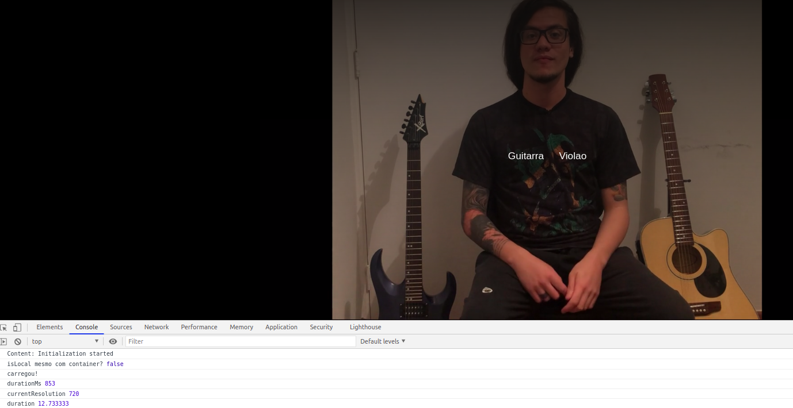

# JS Expert Week
Promovida pelo [Erick Wendel](https://github.com/ErickWendel), de 26 à 30 de Outubro de 2020, a JS Expert Week foi um projeto com o objetivo de implementar uma aplicação em NodeJS que simule a forma como o Netflix produziu o filme Black Mirror Bandersnatch (2018). Ou seja, a aplicação trata a entrega de conteúdo em streaming, do servidor para o browser, analisando o tempo para determinar qual a resolução de cada entrega. Além disso, antes do download do trecho seguinte, o usuário pode interagir com o vídeo selecionando uma opção.

## Tecnologias Utilizadas

1. NodeJS para a construção do back-end em JavaScript (http-server)
2. [FFMPEG & FFProbe](https://ffmpeg.org/ffmpeg.html) para conversão e manipulação dos vídeos em .mp4
3. [MP4Box](https://github.com/gpac/gpac/wiki/MP4Box) para extrair informações dos arquivos de vídeo
4. [Docker](https://www.docker.com/get-started)
5. [VSCode](https://code.visualstudio.com/download) e a extensão [Remote-Containers](https://marketplace.visualstudio.com/items?itemName=ms-vscode-remote.remote-containers) para que, através do Docker, o projeto rodasse dentro de um container com todas as dependências necessárias
6. AWS CloudFront para deploy em produção

## Lista de Títulos


## Vídeo


## Pré-requisitos

Possuir, instalados: Docker, VS Code e a extensão Remote-Containers

## Instruções

1. Clonar o repositório
2. Abrir o projeto com o CS Code e aceitar a opção de reabrir o container pelo Remote-Containers

>O [Pedro Renan](https://github.com/pedrorenan) tem um artigo muito bom sobre Remote-Containers chamado ["Em busca da independência para o ambiente de desenvolvimento"](https://medium.com/@pedrorenan/em-busca-da-independ%C3%AAncia-para-o-ambiente-de-desenvolvimento-2adc22f6f250).

3. Executar o script "script.sh": Responsável por gerar cópias de cada vídeo de 1080p nas resoluções menores de 720, 360 e 144p em seus respectivos diretórios
4. Subir os dois servidores em dois terminais diferentes:

```bash
#Terminal 1
#execute o CDN
$ npm run assets
```

```bash
#Terminal 2
#execute a aplicação
$ npm run dev
```
>Assim, já será possível acessar a aplicação através do http://localhost:8080 ou http://127.0.0.1:8080

5. Com a aplicação rodanddo, basta clicar na miniatura da Semana JS EXPERT e apertar o play!

## Deploy

O link para acessar o projeto em produção é o seguinte: https://d2xv4gnlbsbzkq.cloudfront.net/bandersnatch/index.html



Durante a execução do vídeo, é possível acompanhar pelo console o tempo para download de um trecho de vídeo e a resolução escolhida em função desse tempo!

## Créditos

- Layout da lista foi baseada no  codepen do [Carlos Avila
](https://codepen.io/cb2307/pen/XYxyeY)
- Layout do video foi baseado no codepen do [Benjamin Pott](https://codepen.io/benjipott/pen/JELELN)
- O projeto que me serviu como base foi o do [Pedro Renan](https://github.com/pedrorenan/js-expert-week)


